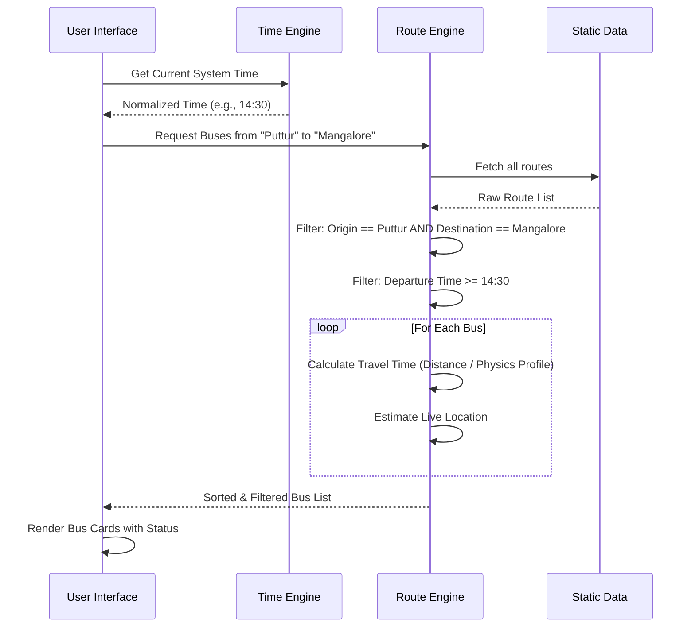

# 🏗️ PutturBus Architecture

This document provides a technical deep-dive into the system architecture, data flow, and core logic engines of PutturBus.

---

## 📐 System Context

PutturBus is a client-side heavy application built on Next.js. Most logic runs in the browser to ensure instantaneous feedback, with static data pushed at build time.

```mermaid
graph TD
    User[User Device] -->|Visits Web App| CDN[Next.js Host (Vercel/Netlify)]
    CDN -->|Serves Static Assets| User
    User -->|Interacts| ClientApp[React Client App]
    
    subgraph Client Application
        Router[App Router]
        Store[Local State]
        
        subgraph Engines
            RouteEngine[Route Engine]
            TimeEngine[Time Normalizer]
            GeoEngine[Geo-Spatial Engine]
        end
        
        Router --> Engines
        Engines --> Store
    end
    
    subgraph Data Layer
        StaticJSON[Static Bus JSON]
        OSM[OpenStreetMap Tiles]
    end
    
    ClientApp -->|Fetches| StaticJSON
    ClientApp -->|Requests Tiles| OSM
```

## 🔄 Data Flow: Route Calculation

How do we calculate which buses to show and where they are?



## 🧩 Core Components

### 1. Route Engine (`lib/route-engine.ts`)
The brain of the operation. It handles:
*   **Pathfinding**: Matching start/end stops to route arrays.
*   **Physics**: Applying speed constants based on bus type (Express vs Ordinary).
*   **Ranking**: Sorting results by departure time.

### 2. Time Engine (`lib/time.ts`)
Handles the complexities of time.
*   **Normalization**: Converts "4:00 PM", "16:00", and "1600" into a comparable integer.
*   **Deltas**: Calculates "Time to Departure" safely, handling day rollovers.

## 🛠️ Tech Stack

| Layer | Technology | Reason |
| :--- | :--- | :--- |
| **Framework** | Next.js 14 | SSR for initial load, Client-side navigation for speed. |
| **Language** | TypeScript | Type safety for complex data structures (Routes, Stops). |
| **Styling** | Tailwind CSS | Rapid UI development and small bundle size. |
| **Maps** | Leaflet + React-Leaflet | Lightweight, mobile-friendly map rendering. |

---

[⬅️ Back to README](../README.md)
